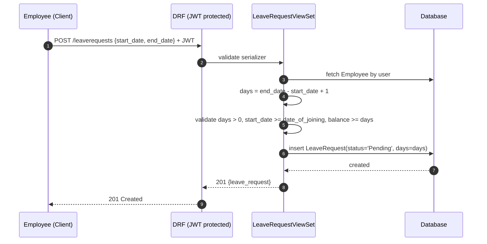
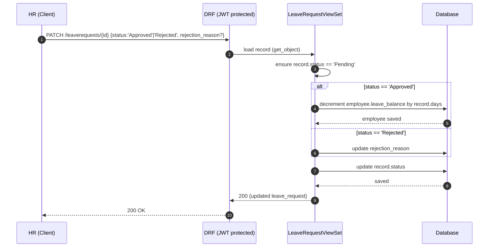
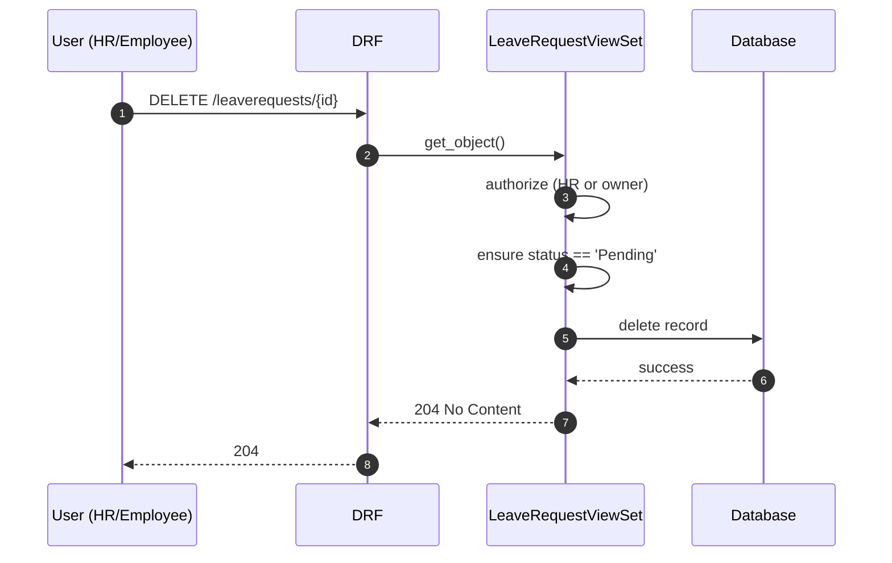

# High-Level Design (HLD) – Mini Leave Management System

This document captures the **class model**, **core workflows**, and **pseudocode** for the main behaviors of the system as implemented in Django + DRF + SimpleJWT.

---

## 1) Class Diagram (Mermaid)

> You can render this at https://mermaid.live

```mermaid
classDiagram
    direction LR

    class CustomUser {
        +id: UUID/Auto
        +email: str
        +password: str (hashed)
        +is_hr: bool
        +is_active: bool
        +is_staff: bool
        +date_joined: datetime
    }

    class Employee {
        +id: int
        +user: CustomUser [OneToOne]
        +department: str
        +date_of_joining: date
        +leave_balance: int
    }

    class LeaveRequest {
        +id: int
        +employee: Employee [FK]
        +start_date: date
        +end_date: date
        +days: int (computed)
        +status: enum('Pending','Approved','Rejected')
        +rejection_reason: str
        +created_at: datetime
        +updated_at: datetime
    }

    class RegisterView {
        +POST(email, password, is_hr) -> access_token
    }

    class LoginView {
        +POST(email, password) -> access_token
    }

    class EmployeeAPI {
        +"GET /employees/"
        +"POST /employees/"
        +"GET /employees/{id}/"
        +"PATCH /employees/{id}/"
        +"DELETE /employees/{id}/"
        +"GET /employees/me/"
    }

    class LeaveRequestViewSet {
        +list()
        +create(start_date, end_date)
        +partial_update(id, ...)
        +destroy(id)
        +get_queryset() -> HR: all, Emp: own
    }

    CustomUser "1" <-- "1" Employee : one-to-one
    Employee "1" <-- "0..*" LeaveRequest : has many
    RegisterView ..> CustomUser : creates
    LoginView ..> CustomUser : authenticates
    EmployeeAPI ..> Employee : CRUD
    LeaveRequestViewSet ..> LeaveRequest : CRUD

```

---

## 2) Core Workflows (Sequence Diagrams)

### 2.1 Apply for Leave (Employee)


### 2.2 Approve/Reject Leave (HR)


### 2.3 Delete Leave (HR or Employee if Pending)


---

## 3) Pseudocode – Key Logic

### 3.1 Create Leave Request (Employee)
```text
function create_leave(request):
    serializer.validate_or_400()
    employee = Employee.by_user(request.user)

    days = (end_date - start_date).days + 1
    if days <= 0: 400 "Invalid date range"

    if start_date < employee.date_of_joining:
        400 "Leave start date cannot be before date of joining"

    if employee.leave_balance < days:
        400 "Insufficient leave balance"

    save LeaveRequest(employee=employee, days=days, status="Pending")
    return 201 with serialized leave
```

### 3.2 Update Leave Request
```text
function partial_update(request, id):
    record = get_object(id) or 404

    if record.status != "Pending":
        400 "Cannot update a leave request that is not pending"

    if request.user.is_hr:
        data = filter(request.data, ["status", "rejection_reason"])
        if data.status == "Approved":
            record.employee.leave_balance -= record.days
            record.employee.save()
        elif data.status == "Rejected":
            record.rejection_reason = data.get("rejection_reason","")
        else:
            400 "Invalid status"
        record.status = data.status
        record.save()
        return 200 with serialized record

    # Employee updating own dates (not status)
    if "status" in request.data:
        403 "Employees cannot change status"

    serializer.validate_or_400(partial=True)
    days = (end_date - start_date).days + 1
    if days <= 0: 400
    if record.employee.leave_balance < days: 400
    if start_date < record.employee.date_of_joining: 400
    save(days=days)
    return 200
```

### 3.3 Delete Leave Request
```text
function destroy(request, id):
    record = get_object(id) or 404
    if not (request.user.is_hr or record.employee.user == request.user):
        403
    if record.status != "Pending":
        400 "Cannot delete a leave request that is not pending"
    record.delete()
    return 204
```

---

## 4) Data Model (Relational View)

```text
TABLE custom_user (
    id PK,
    email UNIQUE NOT NULL,
    password HASH NOT NULL,
    is_hr BOOLEAN DEFAULT FALSE,
    is_active BOOLEAN DEFAULT TRUE,
    is_staff BOOLEAN DEFAULT FALSE,
    date_joined DATETIME DEFAULT now()
);

TABLE employee (
    id PK,
    user_id UNIQUE FK -> custom_user(id),
    department VARCHAR(64),
    date_of_joining DATE NOT NULL,
    leave_balance INTEGER DEFAULT 15
);

TABLE leave_request (
    id PK,
    employee_id FK -> employee(id),
    start_date DATE NOT NULL,
    end_date DATE NOT NULL,
    days INTEGER NOT NULL,
    status ENUM('Pending','Approved','Rejected') DEFAULT 'Pending',
    rejection_reason TEXT DEFAULT '',
    created_at DATETIME DEFAULT now(),
    updated_at DATETIME DEFAULT now()
);
```

---

## 5) Assumptions
- One employee per user (1–1 mapping).
- Leave balance is decremented **only on approval**.
- Pending requests can be edited or deleted; approved/rejected cannot be modified by employee.
- HR can view all data; employees can only view their own.

---

## 6) Non-Functional Considerations
- Auth: JWT access token required for protected endpoints.
- Validation: consistent 4xx errors for invalid state and permissions.
- Scalability: move to PostgreSQL, add caching for lists, rate-limit auth endpoints, and paginate lists.
- Observability: add DRF throttling, logging of state changes (audit), and health checks.
